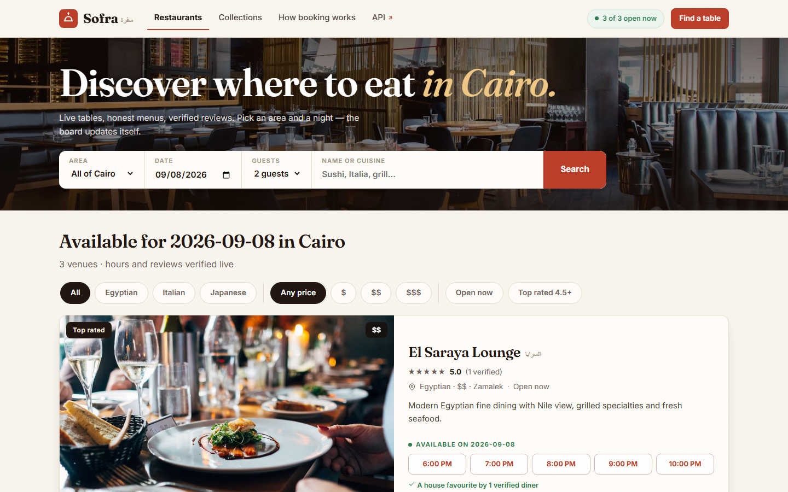
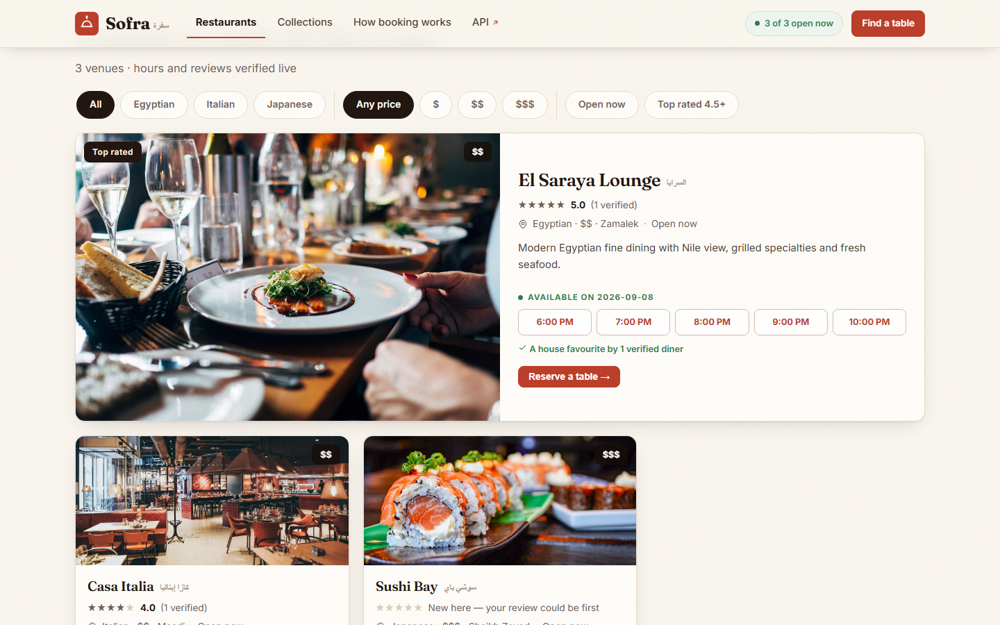
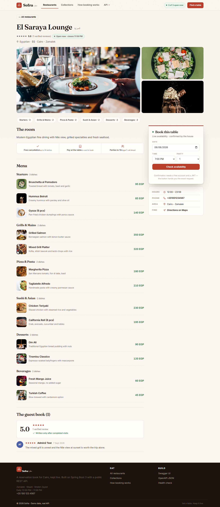
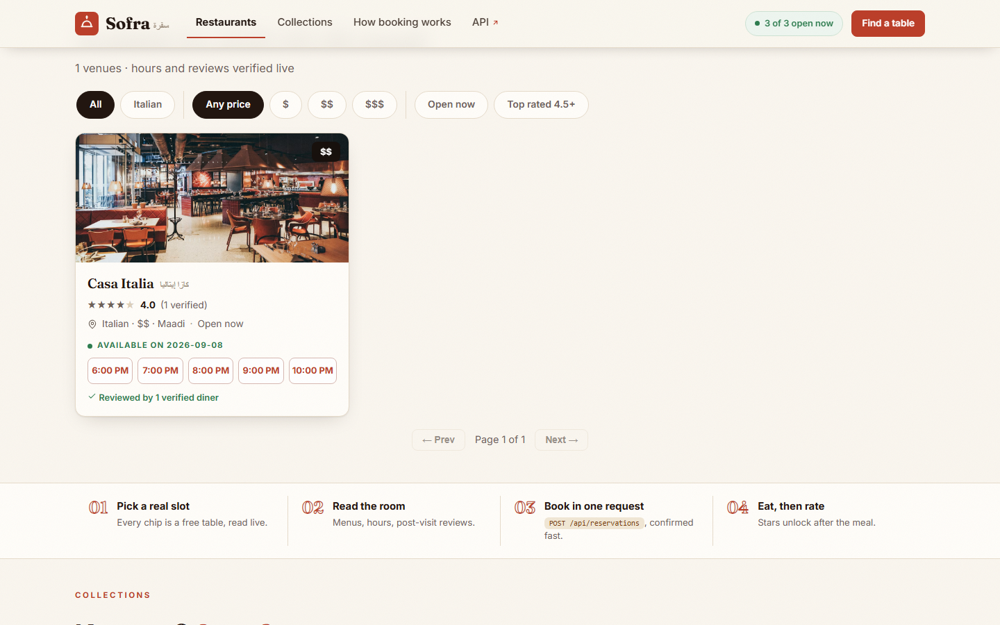
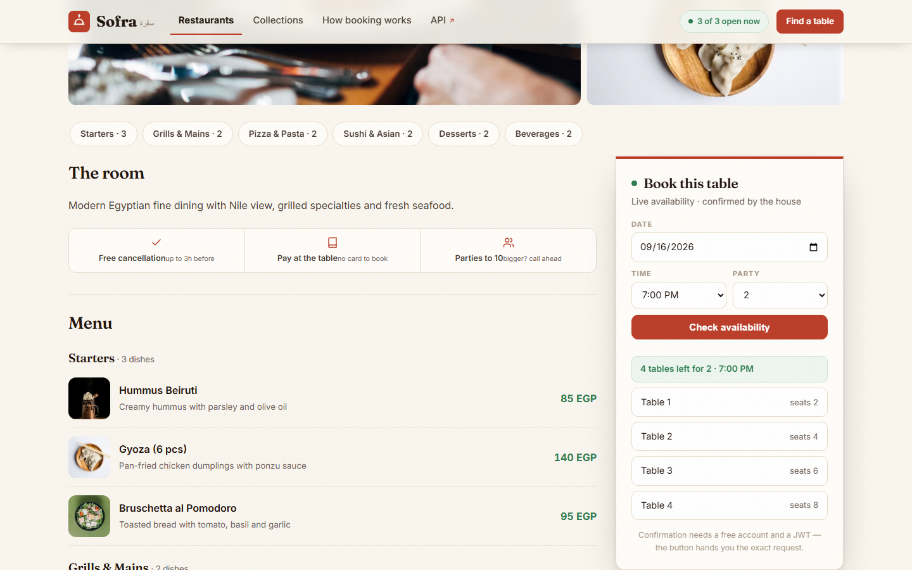
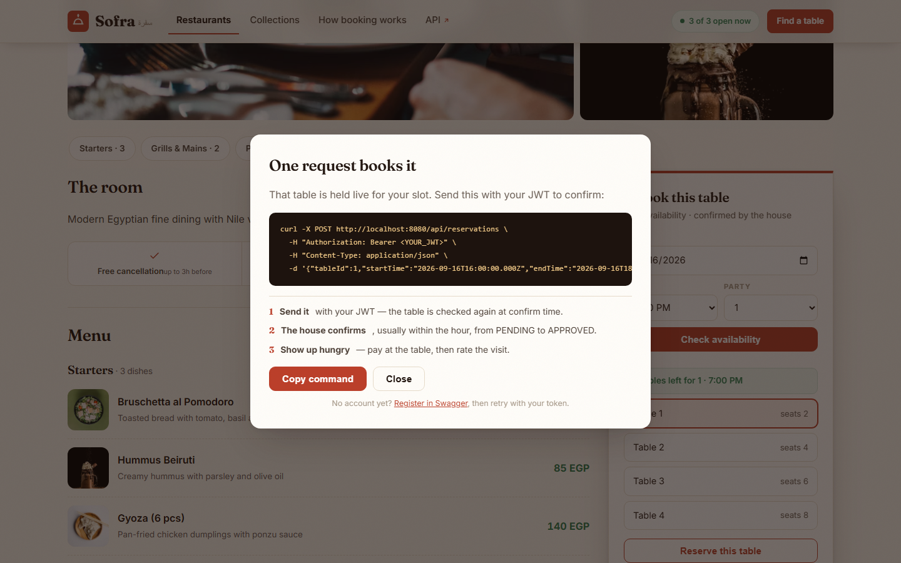
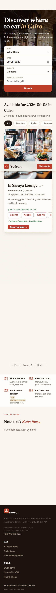
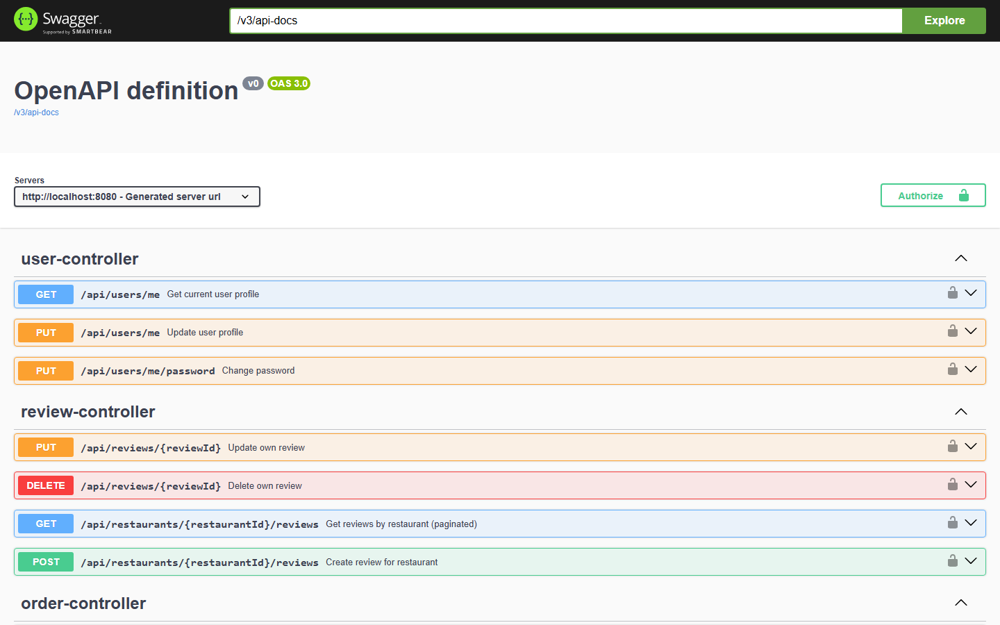
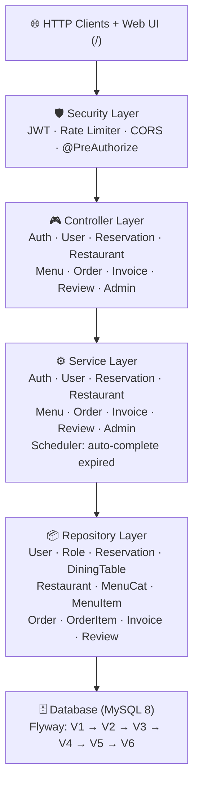

# 🍽️ Sofra — Restaurant Reservation System

[](https://openjdk.org/projects/jdk/21/)
[](https://spring.io/projects/spring-boot)
[](https://www.mysql.com/)
[](https://jwt.io/)
[](https://www.docker.com/)
[](https://flywaydb.org/)
[](#-testing)
[](https://swagger.io/)
[](.github/workflows/ci.yml)

A production-grade restaurant reservation and management platform built with **Spring Boot 3.3.5** and **Java 21**. Guests browse restaurants, book tables (admin approval workflow), order from a live menu, get auto-generated invoices, and leave verified reviews — all behind JWT security with rate limiting, plus an OpenTable-style booking web UI.

> 🏗️ **Architecture:** Layered monolith (Controller → Service → Repository → MySQL) with JWT-secured REST API, Flyway versioned migrations (V1 → V6 incl. demo seed), sliding-window rate limiting, Actuator health checks, and a booking web UI served at `/`.

## 📑 Table of Contents

- [✨ Features](#-features)
- [🧰 Tech Stack](#-tech-stack)
- [📸 Screenshots](#-screenshots-live-from-this-repo)
- [🖥️ Web UI](#️-web-ui)
- [📐 System Architecture](#-system-architecture)
- [🗄️ Database Schema & Migrations](#️-database-schema--migrations)
- [🔄 Reservation & Order Lifecycles](#-reservation--order-lifecycles)
- [🛡️ Security](#️-security)
- [📡 API Endpoints](#-api-endpoints)
- [💡 Example API Usage](#-example-api-usage)
- [📄 Conventions: Pagination & Errors](#-conventions-pagination--errors)
- [⚙️ Invoice Calculation](#️-invoice-calculation)
- [🧪 Testing](#-testing)
- [🚀 Quick Start](#-quick-start)
- [🔧 Configuration](#-configuration)
- [🐳 Docker](#-docker)
- [🤖 CI/CD](#-cicd)
- [🗺️ Roadmap & Known Limitations](#️-roadmap--known-limitations)
- [📁 Project Structure](#-project-structure)
- [👤 Author](#-author)

---

## ✨ Features

**For guests**
- 🔍 Browse/search restaurants by name, area or cuisine (paginated)
- 📅 Book a specific table for a time window (conflict-checked, capacity-checked)
- 🍽️ Live menu with categories, prices and availability
- 🧾 Auto-generated invoices (14% tax + 10% service) on completed orders
- ⭐ Verified reviews — only after a completed stay, one per diner per restaurant

**For restaurants / admins**
- 🏢 Restaurant & dining-table CRUD (soft delete, duplicate guards)
- ✅ Approve / reject reservation workflow + admin cancel
- 📋 Menu category & item management
- 👑 Owner-role assignment
- 📦 Full order lifecycle with a server-side state machine

**Platform**
- 🔐 JWT access (24h) + rotating refresh tokens (7d), BCrypt-12 passwords
- 🚦 Sliding-window rate limiting on auth endpoints with `Retry-After`
- 🗄️ Flyway migrations (V1 → V6) + demo seed data on first boot
- ❤️ Actuator health/info, structured JSON errors, Docker + CI ready

---

## 🧰 Tech Stack

| Layer | Technology |
|-------|------------|
| Language / Framework | Java 21, Spring Boot 3.3.5 (Web, Data JPA, Security, Validation, Actuator) |
| Auth | Spring Security 6 + jjwt 0.11.5 (HMAC-SHA256), BCrypt |
| Database | MySQL 8 (prod/dev), Flyway, H2 in MySQL-mode (tests) |
| API docs | SpringDoc OpenAPI 2.3.0 (Swagger UI) |
| Frontend | Vanilla HTML/CSS/JS, no build step (served from `/static`) |
| Build / Deploy | Maven wrapper, multi-stage Dockerfile, docker-compose, GitHub Actions |
| Testing | JUnit 5, Mockito, AssertJ, MockMvc, `@DataJpaTest` |

---

## 📸 Screenshots (live, from this repo)

### Home — compact booking search (area · date · guests)


### The board — featured venue, cuisine/price/rating filters, honest time slots


### Restaurant page — gallery, sticky booking widget, counted menu, trust summary


### Live search + filters (area search shown)


### Booking widget — real availability ("4 tables left"), exact-table picking


### Reserve modal — copy-paste `curl` with your JWT + next steps


### Mobile — stacked search, scrollable slots, sticky booking bar


### Swagger UI — full API reference


### Health check


---

## 🖥️ Web UI

A dependency-free booking frontend at `/` (no build, no framework) that talks only to the public REST API:

- **Discovery first:** area/date/party search bar → "Available tonight" board with cuisine, price, open-now and top-rated filters
- **Marketplace cards:** real photos, live ratings, "Top rated" ribbon, evening time slots (past hours honestly disabled), Arabic house-names
- **Venue pages:** photo gallery, sticky booking widget with **exact-table picking** ("Table 3 · seats 6"), menu with dish photos, verified-review guest book, click-to-call + Maps directions, schema.org JSON-LD
- **Trust from data only:** open-now badges computed from posted hours, counts from `totalElements`, never fake numbers

---

## 📐 System Architecture



---

## 🗄️ Database Schema & Migrations

### Tables Overview

| Table | Key Columns | Purpose |
|-------|-------------|---------|
| `users` | email (unique), password_hash, status, email_verified | User accounts |
| `roles` | name (ROLE_USER / ROLE_OWNER / ROLE_ADMIN) | Role definitions (seeded V2) |
| `user_roles` | user_id + role_id (unique pair) | Many-to-many join |
| `restaurants` | name, location, cuisine, price_range, opening_time, closing_time, phone, description, image_url | Restaurant profiles |
| `dining_tables` | table_number, capacity, table_status, restaurant_id | Physical tables |
| `reservations` | user_id, table_id, start_time, end_time, status, guests | Booking records |
| `refresh_tokens` | token_id (unique), token_hash, user_id, expires_at, revoked | JWT refresh tokens |
| `menu_categories` | name (unique), description | Menu grouping |
| `menu_items` | category_id, name, price, description, image_url, available | Menu catalog |
| `orders` | table_id, restaurant_id, user_id, status, notes | Customer orders |
| `order_items` | order_id, menu_item_id, quantity, unit_price (snapshot) | Line items |
| `invoices` | order_id, subtotal, tax (14%), service (10%), total | Auto-generated billing |
| `reviews` | user_id, restaurant_id, rating (1-5), comment | Customer feedback |

> 💡 All entities extend `BaseEntity` (`id`, `created_at`, `updated_at`, `is_deleted`) with real soft-delete filtering via `@SQLRestriction("is_deleted = false")` on every entity.

### Flyway Migrations (`src/main/resources/db/migration/`)

| Version | File | What it does |
|---------|------|--------------|
| V1 | `V1__init_schema.sql` | Core tables: users, roles, user_roles, restaurants, dining_tables, reservations, refresh_tokens |
| V2 | `V2__seed_roles.sql` | Seeds `ROLE_USER`, `ROLE_OWNER`, `ROLE_ADMIN` |
| V3 | `V3__extend_schema.sql` | Restaurant hours/phone/description/image, table status, menu, orders, invoices, reviews |
| V4 | `V4__demo_seed.sql` | Demo data: 3 restaurants, 10 tables, 6 categories, 13 dishes (idempotent `INSERT IGNORE`) |
| V5 | `V5__marketplace_details.sql` | Adds `cuisine` + `price_range`, professional food photography |
| V6 | `V6__fix_beverage_art.sql` | Artwork correction for one menu item |

---

## 🔄 Reservation & Order Lifecycles

### Reservations

1. **Guest** creates reservation → `POST /api/reservations` (validations: future time, capacity, no overlap via pessimistic table lock)
2. Status set to `PENDING`
3. **Admin** approves → `PUT /api/admin/reservations/{id}/approve` (or rejects)
4. **Scheduler** runs hourly → auto-completes expired `APPROVED` reservations

```
PENDING → APPROVED → COMPLETED (auto)
PENDING → REJECTED → CANCELLED (admin)
PENDING / APPROVED → CANCELLED (guest or admin)
```

### Orders (state machine enforced server-side)

```
PENDING → CONFIRMED → PREPARING → READY → SERVED → COMPLETED (+ auto invoice)
   any ↓
CANCELLED
```

Illegal jumps (e.g. `PENDING → COMPLETED`) return `400`. Adding items merges duplicate lines and blocks unavailable dishes and closed orders.

---

## 🛡️ Security

### Auth Flow

1. **Register/Login**: `POST /api/auth/...` → `{ accessToken (JWT, 24h), refreshToken (opaque, 7d), refreshTokenId }`
2. Requests carry `Authorization: Bearer <token>`; `AuthTokenFilter` validates and loads roles
3. **Refresh** rotates the refresh token (old one revoked); **Logout** revokes it (authenticated, full token pair required)

### Security Components

| Component | Responsibility |
|-----------|----------------|
| `JwtUtils` | Generate, parse, validate JWT tokens |
| `AuthTokenFilter` | Extract JWT from `Authorization: Bearer` |
| `JwtAuthEntryPoint` | Return 401 JSON for unauthenticated |
| `ShopUserDetailsService` | Load user by email |
| `RateLimitFilter` | Sliding window: 20 req/min per IP on auth endpoints, `Retry-After` + temporary block |

### Roles

| Role | Permissions |
|------|-------------|
| 🟢 `ROLE_USER` | Own profile, own reservations, menu, orders, reviews |
| 🟡 `ROLE_OWNER` | Inherits USER + (assignable by admin) |
| 🔴 `ROLE_ADMIN` | Full access — restaurants/tables/menu CRUD, approve/reject, role assignment |

### Public vs Protected

- **Public (no token):** `/` web UI, `/actuator/health`, register/login/refresh/forgot/reset, `GET /api/restaurants/**` (browse, details, menu, reviews, availability), Swagger
- **Authenticated:** everything else; **Admin only:** `/api/admin/**` (+ logout requires a token)

---

## 📡 API Endpoints

### 🔓 Public

| Method | Endpoint | Description |
|--------|----------|-------------|
| POST | `/api/auth/register` | Register (password: min 8, letter + digit) |
| POST | `/api/auth/login` | Login → JWT + refresh token |
| POST | `/api/auth/refresh` | Rotate refresh token (old revoked) |
| POST | `/api/auth/forgot-password` | Request reset (15-min token, no email enumeration) |
| POST | `/api/auth/reset-password` | Reset with token |
| GET | `/api/restaurants?search=&page=&size=` | Browse/search by name, area or cuisine (paginated, max 100/page) |
| GET | `/api/restaurants/{id}` | Restaurant details |
| GET | `/api/restaurants/{id}/menu` | Full menu (categories + available items) |
| GET | `/api/restaurants/{restaurantId}/reviews` | Reviews (paginated) |
| GET | `/api/restaurants/{id}/available-tables?startTime=&endTime=` | Free tables in a time range |
| GET | `/actuator/health` | Liveness |

### 🔐 Authenticated

| Method | Endpoint | Description |
|--------|----------|-------------|
| GET | `/api/users/me` | Get profile |
| PUT | `/api/users/me` | Update profile |
| PUT | `/api/users/me/password` | Change password |
| POST | `/api/auth/logout` | Revoke refresh token (token pair required) |
| POST | `/api/reservations` | Create reservation (PENDING) |
| GET | `/api/reservations/my` | My reservations (paginated) |
| GET | `/api/reservations/{id}` | Get own reservation |
| DELETE | `/api/reservations/{id}` | Cancel own reservation |
| POST | `/api/restaurants/{restaurantId}/reviews` | Review (needs COMPLETED stay, one per user) |
| PUT / DELETE | `/api/reviews/{reviewId}` | Update / delete own review |
| POST | `/api/orders` | Create order (table must belong to restaurant) |
| POST | `/api/orders/{id}/items` | Add item (merges duplicates, blocks unavailable) |
| DELETE | `/api/orders/{id}/items/{itemId}` | Remove item |
| PUT | `/api/orders/{id}/status` | Advance status (state machine) |
| DELETE | `/api/orders/{id}` | Cancel order |
| GET | `/api/orders/{id}` | Get order |
| GET | `/api/orders/table/{tableId}` | Orders by table |
| GET | `/api/invoices/{id}` | Get invoice |
| GET | `/api/invoices/order/{orderId}` | Invoice by order (generates on first call) |

### 🛡️ Admin Only (`ROLE_ADMIN`)

| Method | Endpoint | Description |
|--------|----------|-------------|
| POST / PUT / DELETE | `/api/admin/restaurants[/{id}]` | Restaurant CRUD (soft delete) |
| GET | `/api/admin/restaurants` | List (paginated) |
| POST / PUT / DELETE | `/api/admin/tables[/{id}]` | Table CRUD (soft delete, dup-number guard) |
| PUT | `/api/admin/tables/{id}/status` | AVAILABLE / RESERVED / OCCUPIED / OUT_OF_SERVICE |
| GET | `/api/admin/restaurants/{id}/tables` | Tables by restaurant |
| PUT | `/api/admin/users/{userId}/role` | Assign OWNER role |
| DELETE | `/api/admin/reservations/{id}` | Cancel any reservation |
| PUT | `/api/admin/reservations/{id}/approve` | Approve (PENDING only) |
| PUT | `/api/admin/reservations/{id}/reject` | Reject (PENDING only) |
| POST / PUT / DELETE | `/api/admin/categories[/{id}]` | Category CRUD (soft delete, dup guard) |
| POST / PUT / DELETE | `/api/admin/menu-items[/{id}]` | Menu item CRUD (soft delete) |

---

## 💡 Example API Usage

Full happy path (guest books, admin approves, order completes, invoice + review):

```bash
BASE=http://localhost:8080

# 1. Register + login
curl -X POST $BASE/api/auth/register -H 'Content-Type: application/json' \
  -d '{"firstName":"Mona","lastName":"Ali","email":"mona@mail.com","password":"Pass1234"}'
curl -X POST $BASE/api/auth/login -H 'Content-Type: application/json' \
  -d '{"email":"mona@mail.com","password":"Pass1234"}'
# → {"accessToken":"eyJ...","refreshToken":"...","refreshTokenId":"..."}
TOKEN=eyJ...

# 2. Browse + check availability
curl "$BASE/api/restaurants?search=zamalek"
curl "$BASE/api/restaurants/1/available-tables?startTime=2026-09-10T18:00:00Z&endTime=2026-09-10T20:00:00Z"

# 3. Reserve (→ 201, PENDING)
curl -X POST $BASE/api/reservations -H "Authorization: Bearer $TOKEN" \
  -H 'Content-Type: application/json' \
  -d '{"tableId":1,"startTime":"2026-09-10T18:00:00Z","endTime":"2026-09-10T20:00:00Z","numberOfGuests":2}'

# 4. Admin approves (→ 200, APPROVED)
curl -X PUT $BASE/api/admin/reservations/1/approve -H "Authorization: Bearer $ADMIN_TOKEN"

# 5. Order → advance to COMPLETED → invoice auto-generated (14% + 10%)
curl -X POST $BASE/api/orders -H "Authorization: Bearer $TOKEN" \
  -H 'Content-Type: application/json' -d '{"tableId":1,"restaurantId":1}'
curl -X POST $BASE/api/orders/1/items -H "Authorization: Bearer $TOKEN" \
  -H 'Content-Type: application/json' -d '{"menuItemId":6,"quantity":2}'
for s in CONFIRMED PREPARING READY SERVED COMPLETED; do
  curl -X PUT $BASE/api/orders/1/status -H "Authorization: Bearer $TOKEN" \
    -H 'Content-Type: application/json' -d "{\"status\":\"$s\"}"
done
curl $BASE/api/invoices/order/1 -H "Authorization: Bearer $TOKEN"

# 6. Review (needs a COMPLETED stay; one per diner per restaurant)
curl -X POST $BASE/api/restaurants/1/reviews -H "Authorization: Bearer $TOKEN" \
  -H 'Content-Type: application/json' -d '{"rating":5,"comment":"Unreal mixed grill!"}'
```

Negative cases (all covered by live E2E in `scripts/e2e/`): double-booking → `409`, past time → `400`, illegal order jump → `400`, duplicate review → `409`, bad login → `401`, non-admin on `/api/admin/**` → `403`.

---

## 📄 Conventions: Pagination & Errors

**Pagination** — `GET` list endpoints accept `page` (0-based, default `0`) and `size` (default `10`, max `100`) and return:

```json
{
  "content": [ ... ],
  "page": 0, "size": 10,
  "totalElements": 3, "totalPages": 1,
  "last": true
}
```

**Errors** — all failures return a uniform body (never stack traces):

```json
{
  "status": 409,
  "message": "Time slot already booked",
  "errorCode": "RESERVATION_CONFLICT",
  "path": "/api/reservations",
  "timestamp": "2026-09-07T14:47:26Z"
}
```

| Status | Meaning |
|--------|---------|
| 400 | Validation / bad input / illegal state transition |
| 401 | Missing or invalid credentials |
| 403 | Authenticated but not allowed (e.g. not ADMIN, not owner) |
| 404 | Resource not found (incl. soft-deleted) |
| 409 | Conflict (double booking, duplicate name/review) |
| 429 | Rate limited (`Retry-After` header set) |

---

## ⚙️ Invoice Calculation

Auto-generated when an order reaches `COMPLETED` (idempotent — reused on repeat calls):

```
subtotal        = Σ (unitPrice × quantity)
tax             = subtotal × 14%
service_charge  = subtotal × 10%
total           = subtotal + tax + service_charge
```

> Live-verified: 3 × 180 = 540 → tax 75.60 + service 54.00 → **total 669.60** ✔️

---

## 🧪 Testing

**79 tests — all green** (`mvn test`), plus **~70 live endpoint checks** against MySQL (`scripts/e2e/*.ps1`, logs in `logs/`).

| Layer | Tests | Strategy |
|-------|-------|----------|
| 🎮 Controller | 10 | @WebMvcTest + MockMvc (Auth 5, Admin 2, Reservation 3) |
| ⚙️ Service | 55 | Mockito + JUnit 5: Admin 9, Auth 7, Reservation 13, Order 9 (state machine), Invoice 3 (math), Review 6 (guards), Restaurant 4 (search), User 4 |
| 📦 Repository | 13 | @DataJpaTest (H2 MySQL-mode, real queries incl. soft-delete filter) |
| 🏗️ Context | 1 | @SpringBootTest |
| 🌐 Live E2E | ~70 | PowerShell + curl vs MySQL-backed app (register → reserve → approve → order → invoice → review → admin CRUD, incl. negative cases) |

```bash
./mvnw test                                   # 79 unit/integration tests
powershell -ExecutionPolicy Bypass -File scripts/e2e/test-live.ps1    # live E2E
```

---

## 🚀 Quick Start

### Prerequisites
- Java 21, MySQL 8, Maven (or the `mvnw` wrapper — no install needed)

### Option A — Docker (recommended)
```bash
docker compose up --build
```
App → `http://localhost:8080` · Web UI → `http://localhost:8080/` · Swagger → `http://localhost:8080/swagger-ui.html`

### Option B — Local
```sql
CREATE DATABASE restaurant_reservation;
CREATE USER 'dev_user'@'localhost' IDENTIFIED BY 'Dev@2026#';
GRANT ALL ON restaurant_reservation.* TO 'dev_user'@'localhost';
```
```bash
./mvnw spring-boot:run
```

> First boot seeds 3 demo restaurants + menu via Flyway. No users are seeded — register, then make yourself admin:
```sql
INSERT INTO user_roles (user_id, role_id, created_at, updated_at, is_deleted)
SELECT u.id, r.id, NOW(), NOW(), FALSE FROM users u
JOIN roles r ON r.name='ROLE_ADMIN' WHERE u.email='you@mail.com';
-- then login again (roles live inside the JWT)
```

---

## 🔧 Configuration

Copy `.env.example` as a starting point. All values can be set via environment variables:

| Variable | Default | Description |
|----------|---------|-------------|
| `DB_URL` | `jdbc:mysql://localhost:3306/restaurant_reservation?...` | JDBC URL |
| `DB_USERNAME` | `dev_user` | Database user |
| `DB_PASSWORD` | `Dev@2026#` | Database password |
| `JWT_SECRET` | (dev default — **replace in prod!**) | HMAC-SHA256 secret (min 256-bit) |
| `JWT_EXPIRATION` | `86400000` (24h) | Access-token TTL in ms |
| _(refresh TTL)_ | `604800s` (7d, code constant) | Refresh-token lifetime |
| `SPRING_PROFILES_ACTIVE` | — | `prod` in Docker |
| `app.cors.allowed-origins` | `http://localhost:3000,http://localhost:5173` | CORS origins |

---

## 🐳 Docker

| Service | Image | Ports | Notes |
|---------|-------|-------|-------|
| `app` | built from `Dockerfile` (multi-stage, non-root user, healthcheck) | `8080:8080` | Waits for healthy DB, `SPRING_PROFILES_ACTIVE=prod` |
| `db` | `mysql:8.0` | `3307:3306` | Volume `mysql_data`, healthcheck |

```bash
docker compose up --build        # start
docker compose down -v           # full reset (deletes demo data)
```

---

## 🤖 CI/CD

Workflow: `.github/workflows/ci.yml` — runs on push to `main`/`master`/`develop` and PRs:

1. Spins up MySQL 8 service container
2. JDK 21 (Temurin) + Maven cache
3. `mvn verify -B` with CI env overrides (64-char JWT secret, test DB URL)

---

## 🗺️ Roadmap & Known Limitations

Be transparent about what's demo-grade:

- 🔸 **Password-reset delivery** — tokens are generated with 15-min expiry but only logged; wire an SMTP/SES sender for production.
- 🔸 **Single-instance state** — reset tokens live in memory; move to DB/Redis before horizontal scaling.
- 🔸 **No favorites/bookmarks UI** — the API has all data needed; the web UI skips it (no fake buttons).
- 🔸 **No payment flow** — invoices are generated, not charged (by design).
- 🔸 **Interactive table map** — the API already books by exact table id (a real differentiator vs time-only booking); a visual floor-map picker is the natural next epic.
- 🔸 **Email verification** — `email_verified` exists on the model but no verification mail is sent yet.

---

## 📁 Project Structure

```
src/main/java/com/mahmoud/reservation/
├── config/          # OpenAPI / Swagger
├── controller/      # 9 REST controllers
├── dto/             # 30+ request/response DTOs
├── entity/          # 13 JPA entities + BaseEntity (@SQLRestriction soft delete)
├── enums/           # 5 enums
├── exception/       # 7 exceptions + ApiErrorResponse + GlobalExceptionHandler
├── repository/      # 13 Spring Data JPA repos
├── security/        # JWT, auth filter, rate limiter, CORS
├── service/         # 9 services (auth/user/reservation/restaurant/admin/menu/order/invoice/review)
└── resources/
    ├── static/      # Booking web UI (index.html + styles.css + app.js, no build step)
    └── db/migration/# V1 → V2 → V3 → V4 (seed) → V5 → V6
src/test/            # 79 tests (controller/service/repository/context)
scripts/e2e/         # Live endpoint scripts (PowerShell + curl) + detached app starter
docs/screenshots/    # UI screenshots used above
```

---

## 👤 Author

<table>
  <tr>
    <td align="center">
      <a href="https://github.com/MahmoudYoussef-web">
        
      </a>
    </td>
    <td>
      <b>Mahmoud Youssef</b><br/>
      <sub>Backend Engineer — Spring Boot · Java · REST APIs</sub><br/><br/>
      <a href="https://github.com/MahmoudYoussef-web">
        
      </a>
      &nbsp;
      <a href="https://www.linkedin.com/in/mahmoud-youssef-dev/">
        
      </a>
    </td>
  </tr>
</table>
